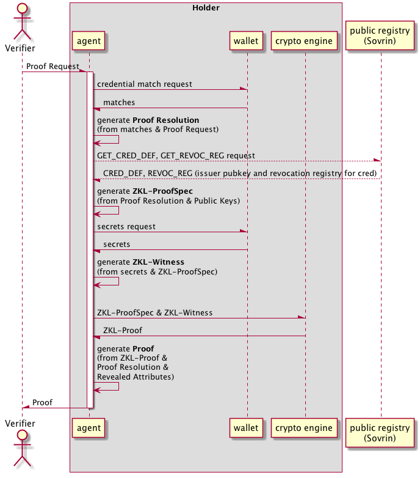

# Lab Name
z-mix

# Short Description
z-mix will offer a generic way to create Zero-Knowledge proofs, proving statements about multiple cryptographic building blocks, containing signatures, commitments, and verifiable encryption.
z-mix facilitates

# Scope of Lab
The goal of z-mix is to become a part of Hyperledger crypto-lib, and eventually be adopted by Hyperledger projects. Multiple existing Hyperledger projects require Zero-Knowledge proofs, e.g., Fabric and Indy. The goal of this library is to provide a single flexible and secure implementation to construct such proofs.

# Initial Committers
* Manu Drijvers (manudrijvers)
* Jan Camenisch (jancamenisch)
* Nathan George (nage)
* Daniel Hardman (dhh1128)
* Angelo De Caro (adecaro)
* Maria Dubovitskaya (dubovitskaya)
* Jason Law (jasonalaw)
* Michael Lodder (mikelodder7)

# Sponsors
* Nathan George
* Hart Montgomery

# Spec
z-mix uses JSON objects to provide a *zero knowledge language (ZKL)* to express

* Requests of attested attribute values
* Resolutions for requests that can be validated
* Proofs that satisfy requests

### Components

1. **Verifiable Credential Proof Request** - Verifier generates a *proof request* to send to the prover.
Prover determines if the Request is appropriate, i.e., should it be fulfilled.
If so, then Prover determines if the Request can be resolved against credentials she has.
If not, then Prover may acquire credentials from issuers.
If it can be resolved, then Prover resolves it by selecting the credentials and attributes that satisfy the Request.
1. **Verifiable Credential Proof Resolution** - Prover generates a *proof resolution*, which is a simplified version of a Proof Request that helps the Verifier know how to confirm the Proof is valid.
Specifically, the Resolution includes a reference to a sepcific credential definition for every "credential" entry in the proof request.
Data that satisfies the non-cryptographic part of the Request.
1. **ZKL Proof Spec** - Generated deterministically from a Resolution and the top-level Schema which provides ordered attributes.
(The inputs are Verifiable Credential Proof Resolution, and all public information \[e.g., Credential Definitions, Revocation Authority, Pseudonyms].)
1. **ZKL Witness** - Prover provides private inputs containing the secrets required to compute a proof.
\[e.g. secret keys, all attribute values, the credentials involved, the randomness used to compute a pseudonym].
1. **ZKL Proof** - Data that satisfies the cryptographic part of the Request.

### ZKL Flow

Holders don't handle cryptographic material or messaging with Verifiers directly, but instead use software and hardware components to do this called agents.
Cryptographic secrets are stored in wallets. Crypto engine is the software/hardware library that performs the ZK computations. Public registry
is any reliable source that stores the public material that both Holder and Verifier. Sovrin is a public permissioned ledger designed for this purpose.

